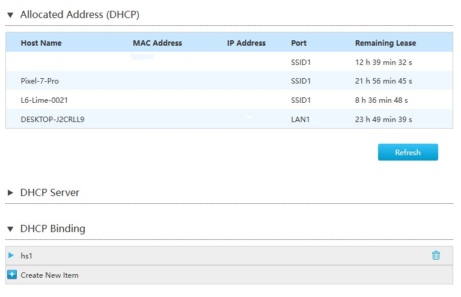
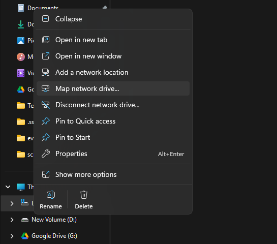
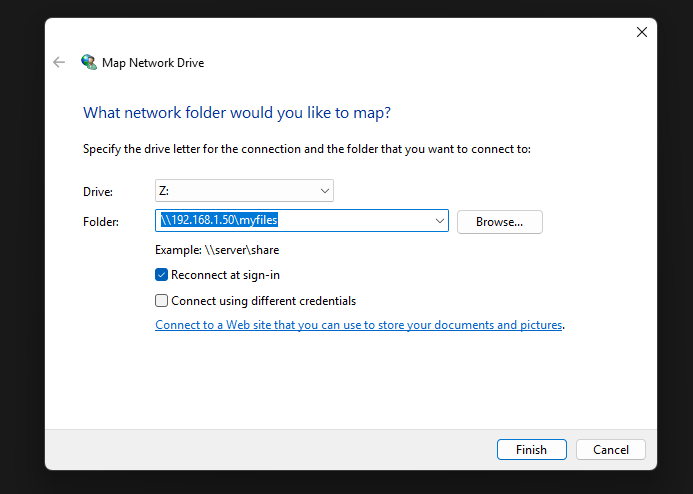
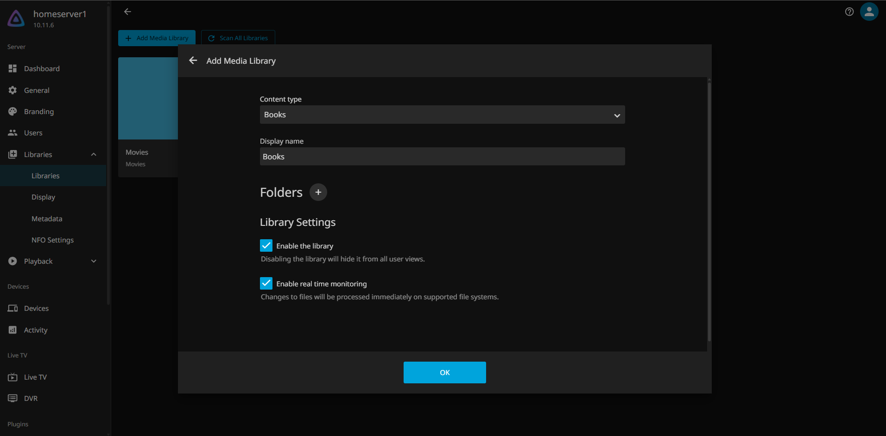
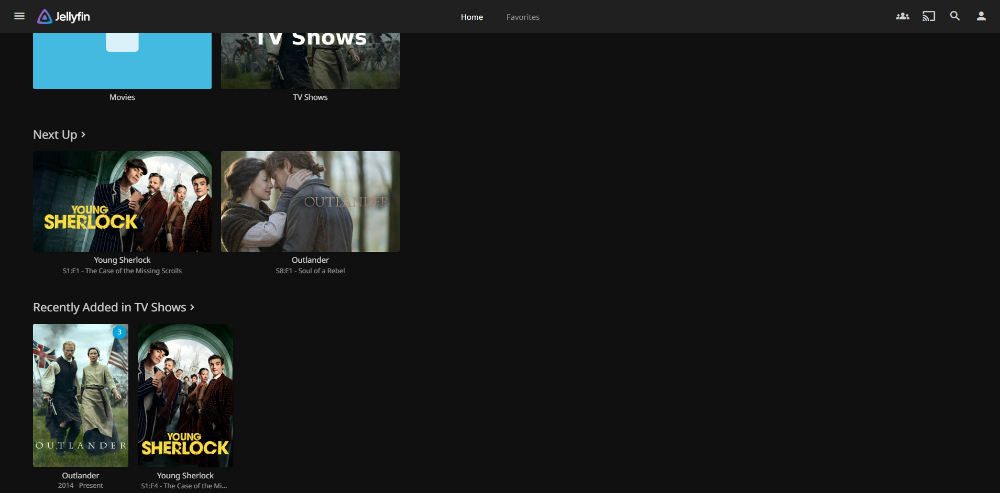
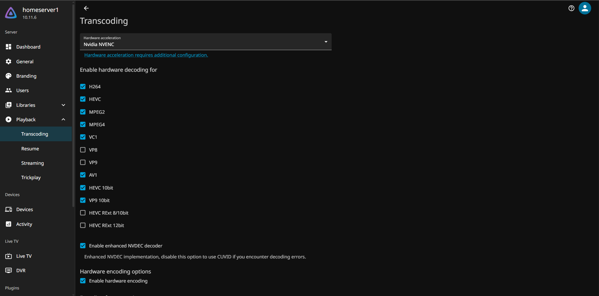

# Home Server Setup

This repository contains the setup process for the laptop i am using as my home server.
If you are using a laptop like me make sure to connect it to ethernet always for better network performance.


## Home Server Specs

- CPU: Intel Core i5-10300H 2.50GHz
- GPU: NVIDIA GeForce GTX 1650 Max-Q
- RAM: 20GB 3200MHz
- Storage: 1TB HDD
- OS: Ubuntu Server 24.04.4 LTS

## Tools and software to installed

- Samba - Network Storage and File sharing (https://www.samba.org/)
- Jellyfin - Media server (https://jellyfin.org/)
- Wireguard - VPN (https://www.wireguard.com/)
- Docker - Containerization platform (https://www.docker.com/)
- Kubernetes/Docker Compose - Container orchestration (https://kubernetes.io/)


## OS Installation and Remote Access Configuration

### Install Ubuntu Server

1. Download Ubuntu Server 24.04.4 LTS from [Ubuntu website](https://ubuntu.com/download/server)
2. Create a bootable USB drive using a tool like [Rufus](https://rufus.ie/) or [balenaEtcher](https://www.balena.io/etcher/)
3. Plug the USB drive into your machine and power it up. Head to the BIOS of your device and, if your device supports UEFI, ensure that Secure Boot is either disabled
4. Boot from your USB drive by entering the Boot Selection Menu and select your Ubuntu USB.
5. Leave the OpenSSH Server checked to have remote access to your machine once it’s set up. Make sure you uncheck “Set up this drive as an LVM group” when asked about partitioning your drive (If you were to leave that checked, it would split your drive into multiple volumes, using only part of your disk, and you would have to manually resize it later).

### Assigning a static IP address

Once the installation is complete, you need to assign a static IP address for the home server on the network. This ensures that you always know what address your server is on for connecting over SSH and will allow you to port forward services later.
**It is recommended that you set this up on your router’s DHCP settings instead of assigning a static IP in server’s network configuration.** 

Set up is different for each router. Go to your router’s web interface and look at the Local Network and DHCP sections. You should find an option related to Static Leases. Find your server’s mac address, and set a static IP.

Find the MAC address of the server for ethernet/wifi
```shell
ip addr show
```



### Setup SSH access on Windows Clients

Once you have a static IP address for your server, you can connect over SSH to run the commands in the server remotely.

1. Install OpenSSH Client on Windows
2. Generate named SSH key pair using `ssh-keygen` command
```shell
ssh-keygen -t rsa -b 4096 -C "[EMAIL_ADDRESS]" -f ~/.ssh/id_rsa_homeserver
```
3. Copy public key to Ubuntu Server
```shell
ssh-copy-id -i ~/.ssh/id_rsa_homeserver.pub [USERNAME]@[IP_ADDRESS]
```
4. add to config file
```shell
Host homeserver1
    HostName [IP_ADDRESS]
    User [USERNAME]
    IdentityFile ~/.ssh/id_rsa_homeserver
```
5. Test SSH connection
```shell
ssh homeserver1
```

### For laptops: keep the server running even if you close the lid. (Optional)

Use `vim` to edit the file `/etc/systemd/logind.conf`.
```shell
sudo vim /etc/systemd/logind.conf
```

Find the below lines, uncomment them by removing the # in the front and change them to the following values.

```shell
HandleLidSwitch=ignore # do nothing (keep running) when the lid is closed while on battery power.
HandleLidSwitchExternalPower=ignore # do nothing (keep running) when the lid is closed while on external power.
HandleLidSwitchDocked=ignore # do nothing (keep running) when the lid is closed while docked.
LidSwitchIgnoreInhibited=no # allow lid switch to work even if some other app is inhibiting it.
```

## Install Tools

### 1. Install/Setup Samba

---

Samba is an open source implementation of the SMB profile, a Microsoft standard for accessing files over a network. SMB provides a native experience on Windows, but it is also available on macOS and Linux.

#### 1. Installation

```shell
sudo apt update
sudo apt install samba
```

#### 2. Create folder for sharing

Create directory to store the files you will be sharing on the network. You may choose to create a folder in the /media/ directory.

```shell
sudo mkdir -p /media/myfiles
```

Since this folder will likely be accessed by other utilities, like Jellyfin, give your user all permissions to avoid issues later on.

```shell
sudo chown $USER: /media/myfiles
```

#### 3. Configure Samba

Edit the Samba configuration file.

```shell
sudo vim /etc/samba/smb.conf
```

By default, Samba will treat any attempts to log in with the wrong credentials as a guest user. This can cause issues on Windows if you accidentally connect with the wrong password, since your shares will not appear. Change the line `map to guest = bad user` to `map to guest = never`.

Add the folder you created to the shares by adding these lines at the end of the file:

```shell
[myfiles] # share name, will be used when connecting over the network
    path = /media/myfiles # folder shared from your server
    writeable=yes # allows the creation and editing of files
    public=no # hides the share if the user isn’t authenticated
```

#### 4. Set Samba password and restart Samba

Lastly, run `sudo smbpasswd -a [youruser]` and set a password for Samba. This will be the password you’ll use on client machines to connect to the network storage. 

Restart Samba to apply the changes.

```shell
sudo systemctl restart smbd
```

#### 5. Configuration on your Client (Windows)

On your Windows PC, you can right-click This PC in the Explorer, and select Map network drive.



Input two backslashes followed by the IP of your server, make sure it’s valid by clicking “Browse” and seeing if your files are in there as they should be.



### Install Nvidia Drivers if GPU is available (Optional)

#### Find the recommended driver version

```shell
ubuntu-drivers devices
```

#### Install the driver

```shell
sudo apt install nvidia-driver-580-open
```

#### Reboot

```shell
sudo reboot
```

#### Verify the GPU

```shell
nvidia-smi
```

#### If Shows error

```shell
NVIDIA-SMI has failed because it couldn't communicate with the NVIDIA driver. Make sure that the latest NVIDIA driver is installed and running
```

This is incredibly common, especially on Ubuntu when installing the `-open` drivers.

reason: Secure Boot.

If Secure Boot is enabled in your server's motherboard BIOS, Linux requires all kernel drivers to be digitally signed. Because you installed the drivers via SSH, you likely missed the hidden background prompt asking you to create a "MOK" (Machine Owner Key) password to sign the drivers, so the kernel blocked them for security reasons.

#### Step 1: Check your Secure Boot status

```shell
mokutil --sb-state
```

If it says "SecureBoot enabled": That is absolutely the culprit. For a Home Server Secure boot is not needed. disable secure boot via BIOS.
If it says "SecureBoot disabled": The driver compilation just failed, and we can skip to Step 3.

#### Step 3: What if Secure Boot was already disabled?

If Secure Boot was disabled, it means the kernel module simply failed to build. We can force it to rebuild the missing pieces using a tool called DKMS.

```shell
sudo dkms autoinstall
```

Once it finish reboot the server and try `nvidia-smi` command again.

### 2. Install/Setup Jellyfin

---

Jellyfin is a free and open-source media management tool for Movies, Shows and Music with a Netflix-like interface that can be accessed from either web or through dedicated apps on windows, android, ios, chromecast and even android tv. It can detect metadata for movies, shows and music from the internet and organize them in a nice easy to use interface.

**Plex is a proprietary alternative to Jellyfin, but it is not free and open-source. It is also more feature-rich and user-friendly than Jellyfin. However, it is not as customizable as Jellyfin. Your choice :)**

#### 1. Install Jellyfin

```shell
curl https://repo.jellyfin.org/install-debuntu.sh | sudo bash
```

#### 2. media folders not showing in Jellyfin

add jellyfin to your user group and grant that group permission to read your media folder.

##### Step 1: Add Jellyfin to your group

```shell
sudo usermod -aG dinith jellyfin
```

##### Step 2: Grant permission to "pass through" your home folder

The jellyfin user needs permission to simply walk through your home folder to get to the media folder. This command grants "execute" (pass-through) permission to your  (if not already granted):
```shell
sudo chmod g+x /home/[USER]
```

##### Step 3: Grant read access to the media folder

Run this to grant read and execute access to the required folders.

ex-:
```shell
sudo chmod -R 755 /home/dinith/media/myfiles/movies
```

#### 3. Restart Jellyfin

For Jellyfin to realize it has been added to a new group, its service needs to be restarted.
```shell
sudo systemctl restart jellyfin
```

#### 4. Setup media folders and upload media files through SMB Share

Once it’s installed, open a browser and go the address `<your_ip>:8096. You will be prompted to setup username, password for authentication.
After that you can set up your directories as you'd like. You may create directories and upload files through your SMB Share and then select these folders in the Jellyfin web interface via add media library option.



**My Jellyfin Homepage**


#### 5. Enable Hardware Acceleration (Optional)

If your home server has a dedicated GPU, you can enable hardware acceleration in Jellyfin to improve video playback performance. This will allow Jellyfin to use the GPU to decode and encode video, which can reduce CPU usage and improve playback quality.

##### Step 1: Grant GPU Permissions
Even though the drivers are installed, Linux restricts access to the GPU hardware for security reasons. We need to add the jellyfin user to the specific Linux groups that handle video processing.

```shell
sudo usermod -aG video,render jellyfin
```

Restart the Jellyfin service to apply permissions:
```shell
sudo systemctl restart jellyfin
```

##### Step 2: Enable Hardware Acceleration in Jellyfin

From the Jellyfin dashboard, Playback → Transcoding.

Under the Transcoding section, find the Hardware acceleration dropdown.

Select the appropriate option for your GPU: Since I have a NVIDIA GPU, I selected Nvidia NVENC.

Also you can decide for which codecs you want to enable hardware acceleration.



Make sure Enable hardware encoding is checked. Scroll all the way to the bottom of the page and Save.

